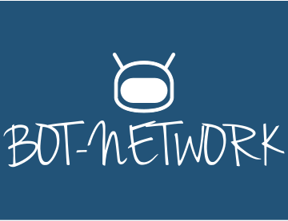

# Restfull Bot Network and Host Platform

## Setup
- pip install -r BotManager/requirements.txt
- Set environment variables for load balancer/Auth Endpoints found in /LoadBalancer/README.md
- Setup and connect to RETHINK db instance and create accounts table

## Run
- Run SlackAuth.py for LB and BotManagerCommandListener.py for Bot placement and management
